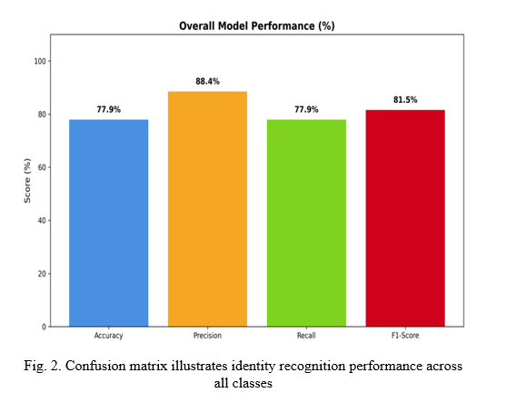

# Results & Evaluation

---

## What We Measured

To evaluate the system, we focused on:

- Identification Accuracy  
- Detection Rate  
- Precision and Recall  
- Stability of identity across frames  

---

## Overall Performance

| Metric | Value |
|--------|------|
| Identification Accuracy | 78.78% |
| Detection Rate | 97.54% |
| Baseline Accuracy | 39.33% |

The proposed system achieves nearly **2× improvement** over the baseline.

---

## Baseline vs Proposed System

The baseline approach relies on single-frame predictions, which leads to:

- Frequent identity switching  
- High misclassification  
- Unstable tracking  

In contrast, the proposed system uses temporal consistency, resulting in:

- More stable identity assignment  
- Reduced false matches  
- Better handling of occlusion and motion  

---

## Confusion Matrix Analysis

From the confusion matrix, we can observe:

- Most identities are correctly classified along the diagonal  
- Misclassifications are reduced compared to baseline  
- Errors mainly occur when:
  - Face visibility is low  
  - Extreme pose variations exist  

This shows that the system performs well under normal conditions but still depends on face quality.

---

## Key Observations

- Temporal buffering significantly improves prediction stability  
- Voting across frames reduces sudden identity changes  
- Confidence filtering helps avoid ambiguous matches  
- Detection remains strong even in challenging scenes  
