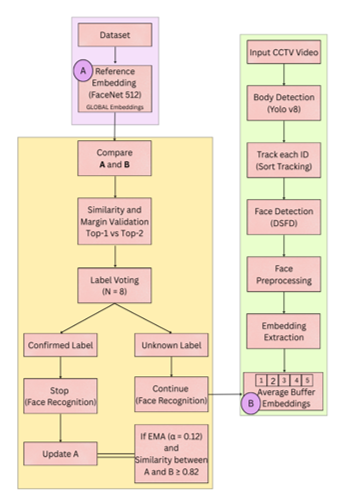

# How the System Works

---

## Overview

This system is designed to identify and track children in real-world CCTV footage.
Instead of relying on a single frame, it combines detection, tracking, and face recognition across multiple frames to make stable identity decisions.
Each child is first detected and tracked, and then identified using face embeddings when possible.

---

## Step-by-Step Breakdown

### 1. Body Detection (YOLOv8)

Each video frame is processed using YOLOv8 to detect all children present in the scene.
This step ensures that even if the face is not visible, the system can still track the person.

---

### 2. Tracking (SORT)

Once bodies are detected, SORT assigns a unique **Track ID** to each child.
This allows the system to follow the same child across multiple frames.

---

### 3. Face Detection (DSFD)

Within each tracked bounding box, DSFD is used to detect the face.
If no face is detected (e.g., back pose), the system skips identification but continues tracking.

---

### 4. Embedding Extraction (FaceNet512)

When a face is detected, it is converted into a numerical representation (embedding).
This embedding captures the unique facial features of the child.

---

### 5. Short-Term Memory (Embedding Buffer)

Instead of using a single embedding:

- The system stores embeddings from the last **5 frames**
- These embeddings are averaged

This reduces noise caused by:
- motion blur  
- lighting variation  
- partial occlusion  

---

### 6. Identity Matching

The averaged embedding is compared with stored reference embeddings using **cosine similarity**.
The system selects the most similar identity.

---

### 7. Confidence Check

Before assigning identity:

- The system compares the top-1 and top-2 similarity scores  
- If the difference is too small, the prediction is rejected  

This prevents uncertain matches.

---

### 8. Temporal Stability (Voting)

To avoid sudden identity changes:

- The system observes predictions over **multiple frames (N = 8)**
- Identity is confirmed only if it remains consistent  

---

### 9. Identity Locking

Once a child is confidently identified:
- The identity is fixed for that track  
- The system stops re-identifying every frame  
This improves both stability and efficiency.

---

### 10. Adaptive Update (EMA)

To handle appearance changes:
- Embeddings are updated using Exponential Moving Average  
- α = 0.12  
This allows gradual adaptation over time.

---

## Summary

This pipeline shifts from:

❌ Single-frame recognition (unstable)  
➡️ To  
✅ Multi-frame, memory-based identification (stable)

---

